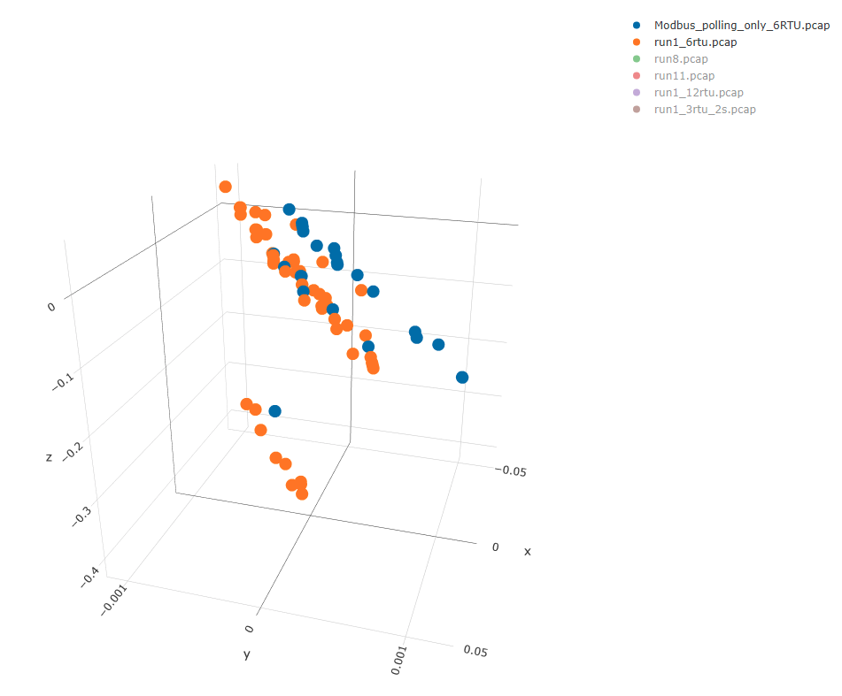
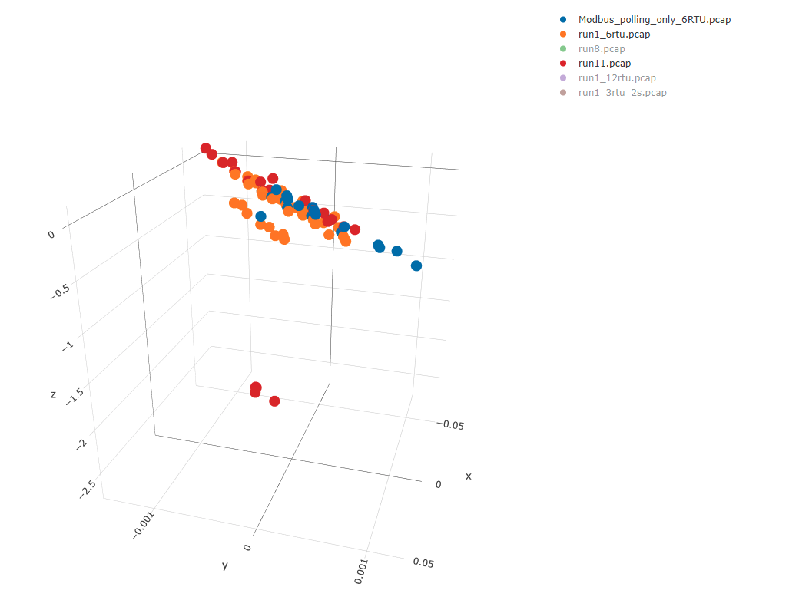
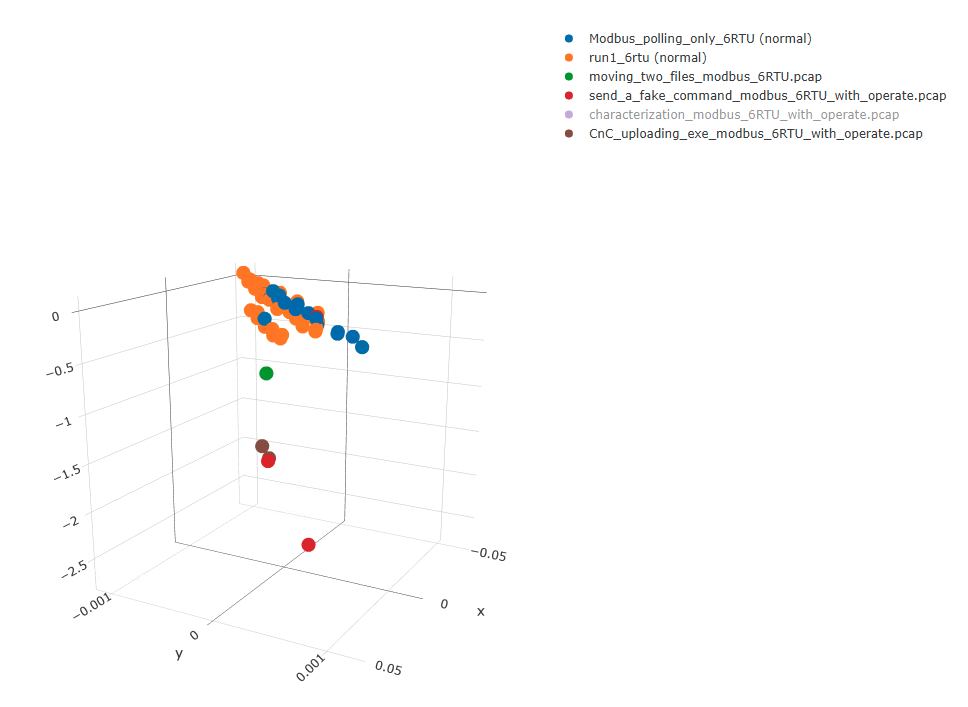

# Experiments and Evaluation of K-Means Anomaly Detection Method

The KMC method is demonstrated on the collection of PCAP files produced by Lemay. The dataset contains two baselines:

* `Modbus_polling_only_6RTU` - 1 hour of regular Modbus traffic including polling only - 1 MTU, 6 RTU and 10 seconds polling interval    
* `run1_6rtu` - 1 hour of regular Modbus traffic including polling and manual operation - 2 MTU, 6 RTU and 10 seconds polling interval

There are also four normal datasets though they represent different system configurations:

* `run8`  - 1 hour of regular Modbus traffic including polling and manual operation - 2 MTU, 3 RTU and 10 seconds polling interval
* `run11` - 1 hour of regular Modbus traffic including polling and manual operation - 2 MTU, 3 RTU and 10 seconds polling interval
* `run1_12rtu`  - 1 hour of regular Modbus traffic including polling and manual operation - 2 MTU, 12 RTU and 10 seconds polling interval
* `run1_3rtu_2s` - 1 hour of regular Modbus traffic including polling and manual operation - 2 MTU, 3 RTU and 2 seconds polling interval

These normal datasets share some communication characteristic with the baseline but there are differences in number of nodes and some operations. 
The last dataset is uses different timing for the messages which means that it represents very different communication patterns 
in terms of operation number per window.

Finally, four datasets are based on normal communication used for learning the profile but contains anomalous operations:

* `moving_two_files_modbus_6RTU` - 3 minutes of regular Modbus traffic including polling only - 1 MTU, 6 RTU and 10 seconds polling interval
* `send_a_fake_command_modbus_6RTU_with_operate` -11 minutes of regular Modbus traffic including polling and manual operation - 1 MTU, 6 RTU and 10 seconds polling interval.
                                                       Also includes sending a Modbus write operation from a compromised RTU using Metasploit proxy functionality and the proxychains tool    
* `characterization_modbus_6RTU_with_operate` - 5.5 minutes of regular Modbus traffic including polling and manual operation - 1 MTU, 6 RTU and 10 seconds polling interval
                                                     Also includes sending a series of modbus read commands to characterize available registers from a compromised RTU
* `CnC_uploading_exe_modbus_6RTU_with_operate` - 1 minute of regular Modbus traffic including polling and manual operation - 1 MTU, 6 RTU and 10 seconds polling interval.
                                                      Also includes sending an EXE file from a compromised RTU to another compromised RTU through a Metasploit meterpreter channel. 

## Profile Computation

The profile was created for the baseline datasets employing four models to characterize the training datasets. The profile consists of the following models 
(note that models will differ each run of the profile creating algorithm, because of random initialization of K-Means++):

| Centroids | Variances |
| --------- | --------- |
| [ -0.033010893, -0.012003078, -0.00027008663 ], [ -0.30194563, -0.019882878, -0.00044319252 ], [ 0.026779978, 0.007819642, 0.00015326802 ], [ -0.039703395, 0.04009675, 0.0009966063 ] | [ 1.0757842E-07, 9.251859E-18, 1.4289103E-07, 8.264039E-07 ] |
| [ 0.01450853, 0.0149164405, 0.00032675124 ], [ -0.30194563, -0.019882878, -0.00044319252 ], [ -0.056954563, 0.042485245, 0.0010616118 ], [ -0.024690224, -0.016750088, -0.00040599666 ], [ 0.037438463, 0.0016354502, -1.6273931E-06 ], [ -0.025902463, 0.03818595, 0.00094460195 ], [ -0.04410512, -0.005673729, -8.887326E-05 ], [ 0.055181026, -0.008403212, -0.0002060933 ] | [ 1.0665617E-08, 9.251859E-18, 5.437238E-07, 1.0249678E-14, 4.450545E-09, 1.1856441E-10, 3.9245656E-08, 0 ] |
| [ -0.022324972, -0.017426161, -0.0003902743 ], [ -0.39290357, -0.021812653, -0.0004387141 ] | [ 4.040865E-06, 5.7890924E-07 ] |
| [ 0.032783817, -0.05082148, -0.0010892205 ], [ -0.059060007, 0.0030652022, 9.7775046E-05 ], [ -0.40932718, -0.012166986, -0.00020951648 ], [ -0.0061050653, -0.027762193, -0.0006233107 ], [ 0.015349132, -0.03530558, -0.00076462654 ], [ -0.088986516, 0.02042483, 0.00049559656 ], [ -0.026115343, -0.0152609665, -0.0003616106 ], [ -0.38117248, -0.028702416, -0.0006024267 ] | [ 1.0555482E-17, 1.2708431E-08, 7.413104E-09, 1.15977915E-10, 4.8427392E-08, 2.3169216E-08, 8.6385645E-09, 1.9247096E-07 ] |

## Profile Application 

As can be seen from the table, the profile learned from the baseline communication can (as expected) spot minor differences 
in other normal traffic and detect violations in datasets containing attacks and other anomalies.

| Source | Points | Accepted | Violated | Accepted (pct) |
| ------ | ------ | -------- | -------- | ------------- |
| Modbus_polling_only_6RTU.pcap (baseline) | 72 | 72 | 0 | 100%|
| run1_6rtu.pcap (baseline) | 144 | 144 | 0 | 100%|
| run8.pcap (normal) | 72 | 67 | 5 | 93%|
| run11.pcap (normal) | 78 | 68 | 10 | 87%|
| run1_12rtu.pcap (normal) | 312 | 173 | 139 | 55%|
| run1_3rtu_2s.pcap (normal) | 72 | 0 | 72 | 0%|
| moving_two_files_modbus_6RTU.pcap (anomal) | 6 | 0 | 6 | 0%|
| send_a_fake_command_modbus_6RTU_with_operate.pcap (anomal) | 19 | 12 | 7 | 63%|
| characterization_modbus_6RTU_with_operate.pcap (anomal) | 14 | 6 | 8 | 42%|
| CnC_uploading_exe_modbus_6RTU_with_operate.pcap (anomal) | 6 | 0 | 6 | 0%|

## Visual Representation
The above presented results can be also observed from 3d visualization of reduced dimensions computed by PCA transformation. 

The computed profile has the following space representation: 

It is possible to see outliers for datasets that does not fully conform to the profile. For instance, `run11` matches the profile for 87% and thus several 
outliers are visible in the graph:

The last graph represents profile together with abnormal communication datasets. It can be seen that for each abnormal dataset there are detectable outliers:

